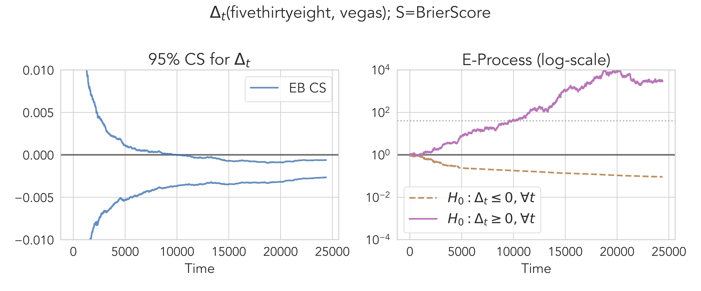

# comparecast

[](https://pypi.org/project/comparecast/)
[](https://pypi.org/project/comparecast/)

Code and Python package accompanying our paper, [**Comparing Sequential Forecasters**](https://pubsonline.informs.org/doi/abs/10.1287/opre.2021.0792), 
published to _Operations Research_ (2023).
A preprint version is also available on [arXiv](https://arxiv.org/abs/2110.00115).

In the paper, we derive anytime-valid and distribution-free inference procedures for comparing sequential forecasters that each make a prediction over a sequence of events.
This accompanying package, named `comparecast`, includes implementations of:
1. **confidence sequence (CS)**: a sequence of confidence intervals that estimate the average score difference between forecasters A and B (which may vary over time);
2. **e-process**: a sequence of evidences against the null hypothesis that forecaster A scores no better than forecaster B _on average_.

Confidence sequences can be continuously monitored without having to worry about "sampling to a foregone conclusion," which happens when using a standard, fixed-time confidence interval and repeatedly peeking at the data.
E-processes also allow peeking at the data before deciding when to stop the experiment ("anytime-valid").
See [here](https://arxiv.org/abs/2210.01948) for an overview of these methods, or [here](https://github.com/gostevehoward/confseq) for a standalone implementation of confidence sequences.

In the plot below, we plot the 95% (empirical-Bernstein) CS and its corresponding e-processes (one for each forecaster) for
comparing the probability forecasts of [_FiveThirtyEight_](https://github.com/fivethirtyeight/data/tree/master/mlb-elo/) and [Vegas odds](https://sports-statistics.com/sports-data/mlb-historical-odds-scores-datasets/) 
on all Major League Baseball games from 2010 to 2019. 
The average [Brier score](https://en.wikipedia.org/wiki/Brier_score) slightly favors Vegas odds over time, 
and the CS closely tracks this average score and represents the uncertainty in estimating the score while accounting for the randomness of data.



See [`nb_comparecast_baseball.ipynb`](nb_comparecast_baseball.ipynb) for the code that generated this plot.

## Installation

Requires Python 3.7+.

From `pip`:
```shell
pip install --upgrade pip
pip install --upgrade pandas seaborn tqdm confseq
pip install --upgrade comparecast
```

From source:
```shell
git clone https://github.com/yjchoe/ComparingForecasters
cd ComparingForecasters

pip install --upgrade pip
pip install -r requirements.txt
pip install -e .
```

## Data Sources

See [`data/README.md`](data/README.md).

## Sample Usage

Also see experiment notebooks below.

### Python

```python
import comparecast as cc

# Generate/retrieve synthetic data
data = cc.data_utils.synthetic.get_data("default", size=1000)

# Calculate, save, and plot the forecasts
forecasters = ["k29_poly3", "laplace", "constant_0.5"]
data = cc.forecast(data, forecasters, out_file="data/test.csv") 
cc.plot_forecasts(data, forecasters, plots_dir="plots/test")

# Compare forecasts using confidence sequences & e-values
results = cc.compare_forecasts(
    data, 
    "k29_poly3", 
    "laplace", 
    scoring_rule="brier", 
    alpha=0.05,
    compute_cs=True,
    compute_e=True,
)
# returns a pandas DataFrame
results.tail(5)
#      time       lcb       ucb         e_pq      e_qp
# 995   996  0.012868  0.072742  2025.725774  0.021684
# 996   997  0.013050  0.072879  2157.262456  0.021672
# 997   998  0.012635  0.072492  1886.687861  0.021596
# 998   999  0.012824  0.072637  2013.209084  0.021583
# 999  1000  0.012447  0.072275  1783.204679  0.021519


# Draw a comparison plot and save in plots/test/*.pdf
results, axes = cc.plot_comparison(
    data, 
    "k29_poly3", 
    "laplace", 
    scoring_rule="brier", 
    alpha=0.05,
    baselines=("h", "acs"),
    plot_e=True,
    plot_width=True,
    plots_dir="plots/test",
)
```

### Command Line Interface
```shell
# Generate synthetic data and forecasts
python3 forecast.py -d default -n 1000 -f all \
    -o forecasts/test.csv -p plots/test

# Compare forecasts and plot results
python3 plot_comparisons.py -d forecasts/test.csv \
    -p k29_poly3 -q laplace --baselines h acs -o plots/test
    
# Compare 538 and vegas forecasters
python3 plot_comparisons.py -d forecasts/mlb_2010_2019.csv \
    -p fivethirtyeight -q vegas --baselines acs -o plots/test/mlb_2010_2019 \
    --ylim-scale 0.01
```

## Experiments

Main experiments (appearing in the main paper):
- [**`nb_comparecast_synthetic.ipynb`**](nb_comparecast_synthetic.ipynb): 
  Experiments on synthetic data and forecasts. 
  Includes comparison with a fixed-time CI.
  Section 5.1 in our paper.
- [**`nb_comparecast_scoringrules.ipynb`**](nb_comparecast_scoringrules.ipynb): 
  Experiments on synthetic data and forecasts using different scoring rules.
  Section 5.1 (Figure 4) in our paper.
- [**`nb_comparecast_baseball.ipynb`**](nb_comparecast_baseball.ipynb): 
  Experiments on Major League Baseball forecasts, 
  leading up to the 2019 World Series.
  Section 5.2 in our paper.
- [**`nb_comparecast_weather.ipynb`**](nb_comparecast_weather.ipynb): 
  Experiments on postprocessing methods for ensemble weather forecasts. 
  Includes e-value comparison with 
  [Henzi & Ziegel (2021)](https://arxiv.org/abs/2103.08402).
  Section 5.3 in our paper.

Additional experiments (some appearing in the E-Companion/Appendix of our paper):
- [**`nb_comparecast_dmgw_miscoverage.ipynb`**](nb_comparecast_dmgw_miscoverage.ipynb):
  Validity comparison with classical comparison methods (DM & GW).
- [**`nb_comparecast_comparison_with_dm_power.ipynb`**](nb_comparecast_dmgw_power.ipynb):
  "Power" comparison with classical comparison methods (DM & GW).
- [**`nb_comparecast_weather_eda.ipynb`**](nb_comparecast_weather_eda.ipynb): 
  Exploratory plots on the ensemble weather forecast dataset. 
- [**`nb_iid_mean.ipynb`**](nb_iid_mean.ipynb): 
  Comparison of uniform boundaries on the mean of IID data.
  Partly reproduces Figure 1 from 
  [Howard et al. (2021)](https://doi.org/10.1214/20-AOS1991).
- [**`nb_cgf_convexity.ipynb`**](nb_cgf_convexity.ipynb):
  Illustration of the Exponential CGF-like function.
- [**`nb_eprocess_ville.ipynb`**](nb_eprocess_ville.ipynb):
  Illustrating some properties of (sub-exponential) e-/p-processes 
  in the context of game-theoretic statistical inference.
  Not used in our paper.


## Code License

MIT

## Authors

[YJ Choe](http://yjchoe.github.io/) and 
[Aaditya Ramdas](https://www.stat.cmu.edu/~aramdas/)

## References

If you use parts of our work, please cite our paper as follows:

Text:
> Choe, Y. J., & Ramdas, A. (2023). Comparing sequential forecasters. _Operations Research_. https://doi.org/10.1287/opre.2021.0792

BibTeX:
```bibtex
@article{choe2023comparing,
  title={Comparing sequential forecasters},
  author={Choe, Yo Joong and Ramdas, Aaditya},
  journal={Operations Research},
  year={2023},
  doi={https://doi.org/10.1287/opre.2021.0792},
  publisher={INFORMS}
}
```
